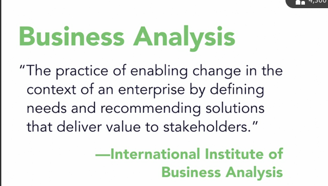
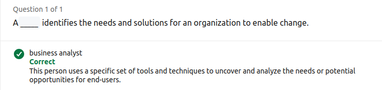
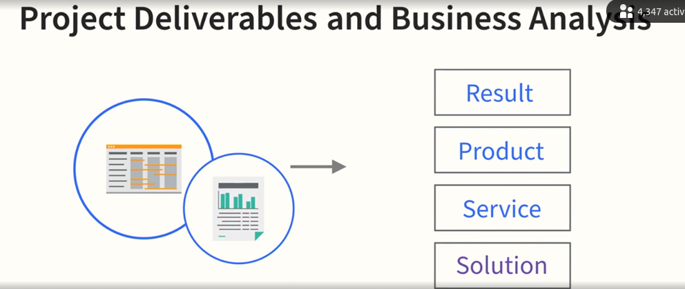
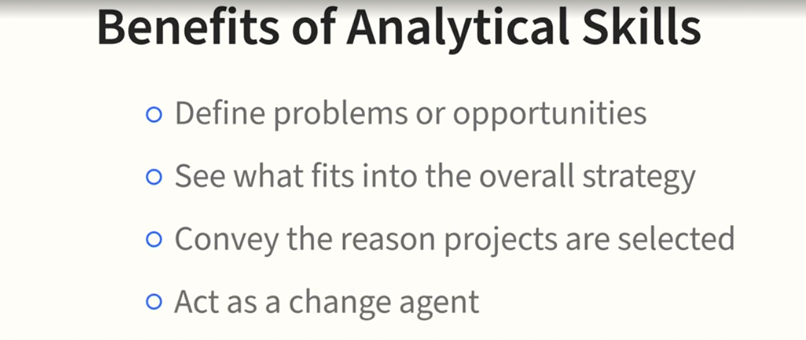
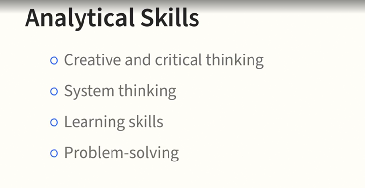
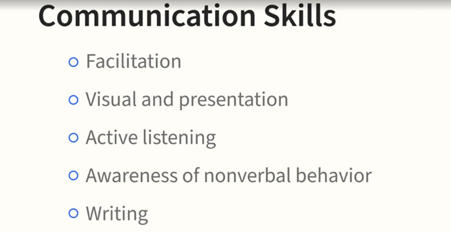
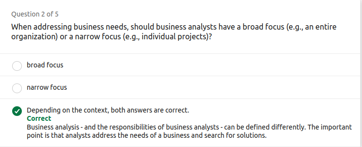
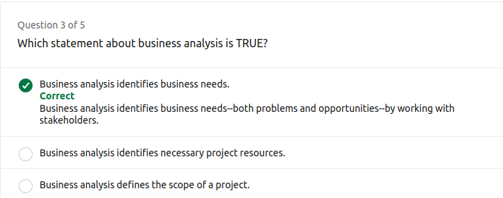
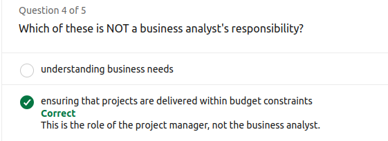
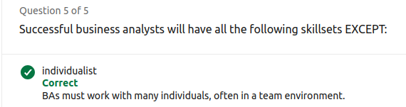

# BA-LinkedIn

# Business Analysis Foundations

## Lecture 1

- **Role and Skills of a Business Analyst**:
  - Understand the responsibilities and essential skills required for a business analyst.

- **Needs Assessment**:
  - Learn the four steps of conducting a needs assessment to identify and validate stakeholder requirements.

- **Stakeholder Identification**:
  - Differentiate the types of stakeholders and their roles in various activities.

- **Project Planning**:
  - Discover the role of a business analyst in the project planning stage.
  - Understand the factors for requirements in the release planning phase.

- **Requirements Breakdown**:
  - Learn to break down requirements from three different perspectives.

- **Solution Evaluation**:
  - Understand the process of testing, validating, and releasing solutions.

---
# What is Business Analysis (BA)?

## Key Takeaways

- **Definition of Business Analysis**:
  - Business analysis involves identifying business needs, recommending relevant solutions, and understanding requirements.

- **Mindset of a Business Analyst**:
  - Business analysts are naturally inquisitive and detail-oriented, constantly observing and questioning processes to identify problems and opportunities.

- **Role of Business Analysts**:
  - They focus on recognizing problems, restructuring them as opportunities, and finding solutions to improve efficiency and effectiveness.

---
# Business Analysis Industry Definitions

## Key Takeaways

- **IIBA Definition**:
  - Business analysis is the practice of enabling change within an enterprise by defining needs and recommending solutions that deliver value to stakeholders.

- **PMI Definition**:
  - Business analysis involves applying knowledge, skills, tools, and techniques to identify problems, determine business needs, recommend solutions, and manage **stakeholder requirements** to meet business and project objectives.
  

- **Overall Takeaway**:
  - Business analysis is defined differently by various organizations, but it generally focuses on identifying and understanding business needs and providing solutions to enable change.

---
# What is the Role of a Business Analyst?

## Key Takeaways

- **Definition and Scope**:
  - The business analyst (BA) role varies based on industry, organization size, maturity, and project methodology.

- **Core Activities**:
  - BAs focus on understanding current needs in relation to strategic objectives and goals, and help achieve these goals through change.
  

- **Situational Role**:
  - BAs may be involved in creating new products, enhancing existing ones, solving problems, and helping project teams understand customer needs.

- **Organizational Impact**:
  - BAs can be part of a business organization, crafting strategic objectives, or a project team, explaining and implementing solutions.
  

- **Change Agent**:
  - BAs play a crucial role as change agents, helping organizations transition from the current state to a desired future state.
  

---
# Business Analyst Skill Set

## Key Takeaways

- **Expert Judgment**:
  - Business analysts need strong business acumen, including understanding the organization's culture and political environment to identify and analyze solutions effectively.

- **Analytical Skills**:
  - Essential skills include critical and creative thinking, problem-solving, and system thinking for breaking down information, drawing conclusions, and formulating decisions.

- **Communication Skills**:
  - Effective communication is crucial, including facilitation, presentation, active listening, and writing skills. BAs spend significant time collaborating with various stakeholders.

- **Leadership**:
  - BAs often assume leadership roles, acting as agents of change and confidently communicating problems and solutions to organizational leaders.

---

# Business Analyst Skill Set

## Key Takeaways

- **Expert Judgment**:
  - Strong business acumen is essential, including understanding the organization's culture and political environment.
  - Expert judgment helps business analysts identify and analyze alternative solutions based on their knowledge of the organization, industry, or application area.

- **Analytical Skills**:
  - Critical and creative thinking, problem-solving, and system thinking are crucial for breaking down information, drawing conclusions, and formulating decisions.
  

- **Communication Skills**:
  - Effective communication, including facilitation, presentation, active listening, and writing, is vital as BAs spend significant time collaborating with various stakeholders.
  

- **Leadership**:
  - BAs often assume leadership roles, acting as agents of change and confidently communicating problems and solutions to organizational leaders.

---
## Quiz

