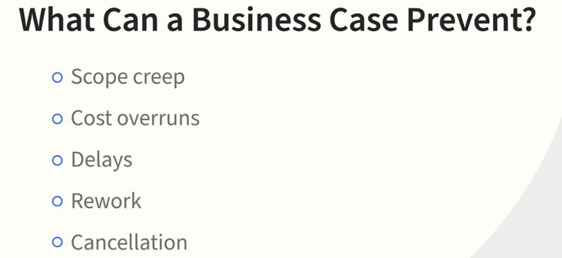

# BA-LinkedIn

# Business Analysis Foundations

## Lecture 1

- **Role and Skills of a Business Analyst**:
  - Understand the responsibilities and essential skills required for a business analyst.

- **Needs Assessment**:
  - Learn the four steps of conducting a needs assessment to identify and validate stakeholder requirements.

- **Stakeholder Identification**:
  - Differentiate the types of stakeholders and their roles in various activities.

- **Project Planning**:
  - Discover the role of a business analyst in the project planning stage.
  - Understand the factors for requirements in the release planning phase.

- **Requirements Breakdown**:
  - Learn to break down requirements from three different perspectives.

- **Solution Evaluation**:
  - Understand the process of testing, validating, and releasing solutions.

---
# What is Business Analysis (BA)?

## Key Takeaways

- **Definition of Business Analysis**:
  - Business analysis involves identifying business needs, recommending relevant solutions, and understanding requirements.

- **Mindset of a Business Analyst**:
  - Business analysts are naturally inquisitive and detail-oriented, constantly observing and questioning processes to identify problems and opportunities.

- **Role of Business Analysts**:
  - They focus on recognizing problems, restructuring them as opportunities, and finding solutions to improve efficiency and effectiveness.

---
# Business Analysis Industry Definitions

## Key Takeaways

- **IIBA Definition**:
  - Business analysis is the practice of enabling change within an enterprise by defining needs and recommending solutions that deliver value to stakeholders.

- **PMI Definition**:
  - Business analysis involves applying knowledge, skills, tools, and techniques to identify problems, determine business needs, recommend solutions, and manage **stakeholder requirements** to meet business and project objectives.
  

- **Overall Takeaway**:
  - Business analysis is defined differently by various organizations, but it generally focuses on identifying and understanding business needs and providing solutions to enable change.

---
# What is the Role of a Business Analyst?

## Key Takeaways

- **Definition and Scope**:
  - The business analyst (BA) role varies based on industry, organization size, maturity, and project methodology.

- **Core Activities**:
  - BAs focus on understanding current needs in relation to strategic objectives and goals, and help achieve these goals through change.
  

- **Situational Role**:
  - BAs may be involved in creating new products, enhancing existing ones, solving problems, and helping project teams understand customer needs.

- **Organizational Impact**:
  - BAs can be part of a business organization, crafting strategic objectives, or a project team, explaining and implementing solutions.
  

- **Change Agent**:
  - BAs play a crucial role as change agents, helping organizations transition from the current state to a desired future state.
  

---
# Business Analyst Skill Set

## Key Takeaways

- **Expert Judgment**:
  - Business analysts need strong business acumen, including understanding the organization's culture and political environment to identify and analyze solutions effectively.

- **Analytical Skills**:
  - Essential skills include critical and creative thinking, problem-solving, and system thinking for breaking down information, drawing conclusions, and formulating decisions.

- **Communication Skills**:
  - Effective communication is crucial, including facilitation, presentation, active listening, and writing skills. BAs spend significant time collaborating with various stakeholders.

- **Leadership**:
  - BAs often assume leadership roles, acting as agents of change and confidently communicating problems and solutions to organizational leaders.

---

# Business Analyst Skill Set

## Key Takeaways

- **Expert Judgment**:
  - Strong business acumen is essential, including understanding the organization's culture and political environment.
  - Expert judgment helps business analysts identify and analyze alternative solutions based on their knowledge of the organization, industry, or application area.

- **Analytical Skills**:
  - Critical and creative thinking, problem-solving, and system thinking are crucial for breaking down information, drawing conclusions, and formulating decisions.
  

- **Communication Skills**:
  - Effective communication, including facilitation, presentation, active listening, and writing, is vital as BAs spend significant time collaborating with various stakeholders.
  

- **Leadership**:
  - BAs often assume leadership roles, acting as agents of change and confidently communicating problems and solutions to organizational leaders.

---
## Quiz

# Business Analysis: Assessing Business Needs

## Key Takeaways

- **Types of Business Needs**:
  - **Problems or Improvement Needs**:
    - Understand the nature of the problem.
    - Assess the impact of the problem on the organization.
    - Identify potential solutions to resolve the issue.

  - **New Opportunities**:
    - Focus on opportunities for organizational growth and expansion.
    - Provide content and insights to support decision-making in these areas.

  - **Compliance Requirements**:
    - Address compliance requirements relevant to the organization and individuals.
  
  
---

# Situation and Solution Statements

## Key Takeaways

- **Documenting Findings**:
  - Documenting findings is crucial for prioritizing work effectively.

- **Situation Statement**:
  - Describes the current problem or opportunity and its impact on the organization.
  - **Format**: "The problem or opportunity has the effect of X on the organization with the resulting impact of Y."
  - **Example**: An existing process causing delays and extra labor costs, leading to additional staff being hired.

- **Tools for Understanding**:
  - **Ishikawa Diagram**:
    - Used for root cause analysis.
  - **Five Whys**:
    - Commonly used in agile projects to dig deeper into the cause of a problem.
  - **Process Flow Models**:
    - Help identify problems and recommend solutions.

- **Solution Statement**:
  - Recommends the most viable option to meet the need.
  - Defines the initial scope and steps to transition from the current state to the future state.

- **Feasibility Study**:
  - May be required to gather more information about the solution's viability, including technical feasibility and cost estimation.

- **Multiple Solutions**:
  - Always provide multiple options for stakeholders to choose the best solution.

---
## quiz

# Who are the Stakeholders?

## Key Takeaways

- **Definition of Stakeholders**:
  - Stakeholders are individuals, groups, or organizations that may be affected by or can impact a decision, activity, or outcome of a project.

- **Types of Stakeholders**:
  - **Proposers**: Individuals or groups who propose the study or project.
  - **Beneficiaries**: Those who will benefit from the solution.
  - **Experts**: Individuals with special knowledge of the situation.
  - **Users**: Those who will use, support, or implement the result.

- **Impact on Projects**:
  - Identifying all stakeholders is crucial for understanding who is affected by the project and who can influence the project, including regulatory groups or internal departments.

---
# Classifying Your Stakeholders

## Key Takeaways

- **Power/Interest Grid**:
  - Stakeholders are classified based on their **power** (ability to affect the project) and **interest** (perception of how the project affects them).
  

- **Stakeholder Categories**:
  - **Low Power, High Interest**:
    - Affected by the project but can't make meaningful changes.
  - **High Power, Low Interest**:
    - Typically executives who want to know the bottom line but may have changing requests.
  - **Low Power, Low Interest**:
    - Often assigned due to availability, referred to as "warm bodies."
  - **High Power, High Interest**:
    - Need significant attention as they can suggest changes and are highly affected by the project.

- **Assessment Importance**:
  - Properly assessing stakeholders helps identify who provides necessary resources, decision-making power, data, and insights for successful business analysis activities.

---

# Engaging Stakeholders

## Key Points

- **Stakeholder Involvement**:
  - Engaging stakeholders in the project increases their support for the outcome.
  - Their understanding of the necessity for change facilitates the transition to the future state.

- **Customized Engagement Plans**:
  - Develop a tailored engagement plan for each stakeholder or group.
  - Consider specific needs and preferences for communication (e.g., email, meetings, phone calls).

- **Clear Communication**:
  - Discuss goals, objectives, and scope boundaries with stakeholders.
  - Ensure you understand their expectations and the reasons behind their information needs.

- **Continual Monitoring**:
  - Regularly monitor stakeholder involvement and adjust engagement strategies as needed.
  - Be prepared for new stakeholders joining and others leaving, and adapt accordingly.

- **Pre-schedule Meetings**:
  - Especially with executives, plan and reserve time for meetings in advance.
  - Remind them of their importance to the project’s success.

|  |  |  |  |
|---------------------------|---------------------------|---------------------------|---------------------------|
---
# Purpose of a Business Case

- A business case justifies the resources needed for a project and aligns it with organizational objectives.
- It includes results from the needs assessment and findings from key stakeholders.

- Ensures the project meets the original requester's needs.
- The business case is a living document and should be updated as organizational objectives change.
- It provides valuable information for project initiation and helps ensure the project remains aligned with the organization's strategy.

|  |  |
|---------------------------|---------------------------|

# Content of a Business Case

- **Major Components**: The business case includes the business needs and the previous analysis of the situation.
  
- **Business Needs Summary**: Identifies needs, stakeholders, and the initial project scope.
- **Stakeholders**: Includes those involved in the needs assessment and those impacted by the project.
- **Previous Analysis**: Covers organizational strategies, goals, root cause analysis, and supporting data for new opportunities.
- **High-Level Assessments**: Includes risk assessments, assumptions, constraints, and recommendations for implementation options.
- **Financial Measurements**: Utilizes methods like 
  - payback period,
  - net present value (NPV), 
  - Depreciation
  - cost benefit analysis,
  - return on investment (ROI) to justify project resources.
- **Collaboration**: The business analyst works with sponsors and key stakeholders to understand business needs and feasibility.

## Quiz
|  |  |  |  |
|---------------------------|---------------------------|---------------------------|---------------------------|

# Project Planning: Vision

- **Vision as a Goal:** The project vision is like a thesis statement or goal, representing an idealistic view of the desired outcome.
- **Shared Vision:** It's crucial for the entire team, including sponsors, project managers, business analysts, and key stakeholders, to build and maintain a consensus on this vision.
- **Project Charter:**

  - **Why:** This is the vision, mission, and goals that are to be delivered by the result.
  - **What:** Objectives identified in the business case, initial boundaries for scope, and what is not included.
  - **Who:** Identify the key stakeholders, both internally and externally, who will play key roles in the project.
  - **When:** The expected start and end dates, especially important when a final date is imposed or a time-sensitive constraint exists.
  - **Where:** The work or deployment sites of the final solution.
  - **How:** The collection of various approaches, including predictive or adaptive methods that are recommended.

- **Elevator Pitch:** The vision should be concise, easily explainable, and frequently reviewed to ensure alignment across the team.

---

# Project Roadmap

- **Purpose of a Roadmap:** A project roadmap is a high-level, chronological representation of the expected delivery of features and functions, dependencies between milestones, and resource requirements. It provides transparency and helps keep everyone aligned.

- **Visualization:** You can visualize the roadmap by using a string across a whiteboard with milestones marked along the way. A paper car or other fun metaphor can be used to represent the team's progress.

- **Flexibility:** The roadmap is flexible and allows the project to adapt to changing organizational objectives. Details are added as the start time nears.

- **Communication Tool:** It's a key communication tool that shows the expected delivery timeframes for benefits and results, helping to keep everyone informed about the project's status.

- **Stakeholder Engagement:** The level of detail in the roadmap should be tailored to various stakeholders, and it should be developed jointly by the business analyst and project manager.
---

# Project Planning: Responsibilities

- **Project Scope vs. Product Scope:** The project manager is responsible for the project scope (deliverables and efforts to complete the project), while the business analyst handles the product scope (features and functions of the solution).

- **Collaborative Activities:** Both the project manager and business analyst jointly identify and analyze stakeholders and plan activities for the team.

- **Business Analyst's Role:** The business analyst provides the project manager with activities needed to elicit, analyze, evaluate, trace, verify, and validate requirements. These are then used to develop the business analysis plan, which is part of the overall project management plan.

- **Adaptive Approach:** In adaptive projects, the business analyst's responsibilities are often fulfilled before release or iteration planning, focusing on clear understanding and prioritization of requirements.

- **Traceability Tools:** The business analyst uses tools like the traceability matrix or task board to ensure all requirements are completed and approved.

